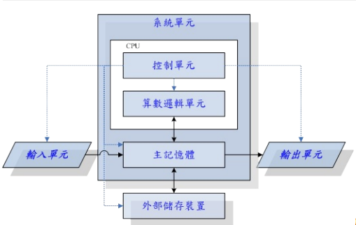

## 0.1.1 计算机硬件的五大单元

##### 1， 计算机数据流向：内存是中转传输器。输入->内存->cpu->内存->输出 || 外存
 

##### 2， 字（bit），字节（byte），内存，内存地址，直接寻址技术，内存表示方式，内存地址的最大数量，指针和内存地址

- 字：bit，最小单位
- 字节：1个byte == 8 bit，是内存中的最小单位，
- 内存：一行就是1byte
- 内存地址：字节的门牌号

>内存就是一栋大楼, 而内存里每1个字节就是大楼的每个房间, 而内存地址就是房间的门牌号码了. 如果没有门牌号码,我们去访问某个住在大楼的人是十分苦难的, 只能从1楼开始每个房间去敲门.. 如果那个人住在顶楼你就悲剧了. 而如果你知道那个人的门牌号码, 就可以直接上去敲他的门查他水表了, 实在是方便很多啊.

- 直接寻址技术：跳楼寻找地址，并发

> 什么意思呢, 还是用上面的例子说明, 假如你知道你要找的人住在那栋大楼的17楼 1702, 但是你还是需要从1楼走到17楼去找他, 这个过程还是需要时间成本的.

> 但是如果你具有了直接寻址技术, 就能直接跳到17楼 1702门前, 如果你找的下1个人在2楼, 又能从17楼直接跳到2楼, 逆天啊.

- 内存地址的表示方式：二进制数字

> 例如，32 位操作系统：0000 1111 1111 0000 1111 0000 1111 0000，可以表示为16进制：0 F F 0 F 0 F 0,也就是Ox0ff0f0f0，其中Ox代表这是十六进制

- 内存地址的最大数量：32位操作系统最多4GB？
> 32位一共2^32个数，也就是2^32个卡条，每个卡条一个byte容量。换算一下就是总共最多4GB的地址条。如果给了一个8GB内存条也只能是4GB的容量，因为地址只有这么多。

> 64位很大！足足17亿GB个地址

- 指针和内存地址：一个指针 == 一个内存地址 == 存储一个byte，int* p
> 对于32位操作系统来说，一个指针就是32位的地址，如果要存储这个地址，那么需要额外的4个内存地址，也就是4个byte，sizeof(p)==4

> 对于64位操作系统来说，一个指针就是64位的地址，如果要存储这个地址，那么需要额外8个内存地址，也就是8个byte，sizeof(p)==8

[详解](https://zhuanlan.zhihu.com/p/41187907 "详解为什么32位系统只能用4G内存")

## 0.1.2 cpu 架构
- RISC: ARM 架构
- CISC：x86 架构
> 那为何称为x86架构呢？
这是因为最早的那颗Intel发展出来的CPU代号称为8086，后来依此架构又开发出80286,
80386...， 因此这种架构的CPU就被称为x86架构了

## 0.2.1 Intel 芯片架构

##### 1，北桥和南桥芯片
- 北桥：通常封装到CPU中，链接速度较快的元件，比如cpu、内存、显卡
- 南桥：链接较慢的元件，比如硬盘、USB、网卡

##### 2，外频、倍频、超频
- 外频：cpu与外部元件进行数据传输的速度
- 倍频：cpu内部用来加速工作性能的倍数

		外频 * 内频 才是cpu的频率速度

- 超频：手动调整外频速度

		现在其实都变了，由于北桥整合到cpu内部，所以无需考虑cpu外频了，只需要考虑整体的频率即可，并且还可以自动实现超频

