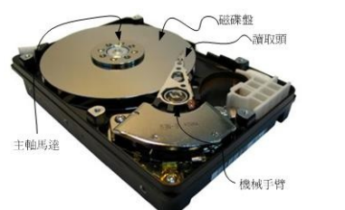
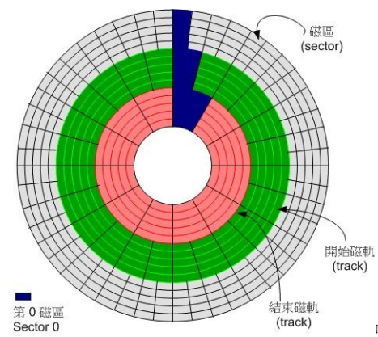
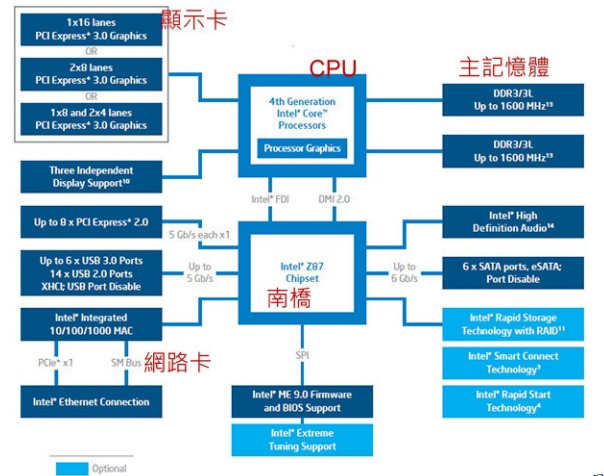

## 0.1.1 计算机硬件的五大单元

##### 1， 计算机数据流向：内存是中转传输器。输入->内存->cpu->内存->输出 || 外存
 

##### 2， 字（bit），字节（byte），内存，内存地址，直接寻址技术，内存表示方式，内存地址的最大数量，指针和内存地址

- 字：bit，最小单位
- 字节：1个byte == 8 bit，是内存中的最小单位，
- 内存：一行就是1byte
- 内存地址：字节的门牌号

>内存就是一栋大楼, 而内存里每1个字节就是大楼的每个房间, 而内存地址就是房间的门牌号码了. 如果没有门牌号码,我们去访问某个住在大楼的人是十分苦难的, 只能从1楼开始每个房间去敲门.. 如果那个人住在顶楼你就悲剧了. 而如果你知道那个人的门牌号码, 就可以直接上去敲他的门查他水表了, 实在是方便很多啊.

- 直接寻址技术：跳楼寻找地址，并发

> 什么意思呢, 还是用上面的例子说明, 假如你知道你要找的人住在那栋大楼的17楼 1702, 但是你还是需要从1楼走到17楼去找他, 这个过程还是需要时间成本的.

> 但是如果你具有了直接寻址技术, 就能直接跳到17楼 1702门前, 如果你找的下1个人在2楼, 又能从17楼直接跳到2楼, 逆天啊.

- 内存地址的表示方式：二进制数字

> 例如，32 位操作系统：0000 1111 1111 0000 1111 0000 1111 0000，可以表示为16进制：0 F F 0 F 0 F 0,也就是Ox0ff0f0f0，其中Ox代表这是十六进制

- 内存地址的最大数量：32位操作系统最多4GB？
> 32位一共2^32个数，也就是2^32个卡条，每个卡条一个byte容量。换算一下就是总共最多4GB的地址条。如果给了一个8GB内存条也只能是4GB的容量，因为地址只有这么多。

> 64位很大！足足17亿GB个地址

- 指针和内存地址：一个指针 == 一个内存地址 == 存储一个byte，int* p
> 对于32位操作系统来说，一个指针就是32位的地址，如果要存储这个地址，那么需要额外的4个内存地址，也就是4个byte，sizeof(p)==4

> 对于64位操作系统来说，一个指针就是64位的地址，如果要存储这个地址，那么需要额外8个内存地址，也就是8个byte，sizeof(p)==8

[详解](https://zhuanlan.zhihu.com/p/41187907 "详解为什么32位系统只能用4G内存")

## 0.1.2 cpu 架构
- RISC: ARM 架构
- CISC：x86 架构
> 那为何称为x86架构呢？
这是因为最早的那颗Intel发展出来的CPU代号称为8086，后来依此架构又开发出80286,
80386...， 因此这种架构的CPU就被称为x86架构了

## 0.2.1 Intel 芯片架构

##### 1，北桥和南桥芯片
- 北桥：通常封装到CPU中，链接速度较快的元件，比如cpu、内存、显卡
- 南桥：链接较慢的元件，比如硬盘、USB、网卡

##### 2，外频、倍频、超频
- 外频：cpu与外部元件进行数据传输的速度
- 倍频：cpu内部用来加速工作性能的倍数

		外频 * 内频 才是cpu的频率速度

- 超频：手动调整外频速度

		现在其实都变了，由于北桥整合到cpu内部，所以无需考虑cpu外频了，只需要考虑整体的频率即可，并且还可以自动实现超频

##### 3，字组大小：cpu一次能处理的数据量。32位，64位

##### 4，超线程（HT）：假的多核
 > 一个cpu一般物理上具有多个核心，但是超线程是抽象的将一个核心进一步分为两个核心使用，具体做法就是在cpu内部将重要的寄存器分成两群，然后可以有两个程序“同时竞争cpu的运算单元”，

## 0.2.2 内存

##### 1，DRAM：动态随机存取，只有在通电时才能记录与使用

##### 2，DDR，DDR2，DDR3，DDR4：Double Data Rate，双倍数据传送，即在一次工作周期中进行两次数据的传送

##### 3，多通道设计：将相同的两个内存汇整在一起，提升内存容量

##### 4，L2高速缓存内存（L2 cache）：cpu内的第二层高速缓存内存，采用SRAM构铸

> 一般内存和cpu打交道，必须通过内存控制器！将L2整合到cpu中，使得cpu直接和数据打交道。但是此时要求L2的频率得跟上cpu的频率，所以采用了更高频率的SRAM来铸造

##### 5，固件（firmware）和 ROM

- 固件：固件就是一个不可编辑的程序，通常直接写死到芯片中
- ROM：固件写到 ROM 上

## 0.2.3 显卡

- Gpu：显卡的高速运算元件，3d加速芯片

## 0.2.4 硬盘与储存设备

##### 1，机械臂，磁盘，马达，磁头：主轴马达让盘片转动，然后机械手臂可伸展让磁头在盘片上头进行读写的动作

##### 2，扇区，磁道，柱面

- 扇区：磁盘的最小单位，外圈扇区较多。由外圈向内圈写数据
- 磁道：一个圆下的所有扇区组成一个磁道
- 柱面：上下磁道组成柱面

##### 3，接口：SATA，SAS，USB

> 早期使用的是SCSI接口，但是被SATA打败了。后来出现了SAS接口的发展，SAS接口速度比SATA快，转盘转速与传输速度也比SATA硬盘好，但是比较昂贵。通常个人电脑主板上面没有内置SAS连接接口，得通过外接卡才能支持。因此个人电脑还是以SATA接口为主要支持。

##### 4，固态硬盘（SSD）：一种闪存（内存）

> 传统硬盘（HDD）需要驱动马达去转动盘片，导致严重的读取延迟。后来就有厂商拿闪存去制作成大容量的设备，也就是固态硬盘。

> 固态硬盘的优缺点：内存直接读写，没数据延迟且快速之外，还很省电。但是有“写入次数的限制”，会损坏，可能要使用 RAID 的机制来防止 SSD 的损毁。

> 目前电脑的配置是使用 SSD 作为系统盘，然后数据储存大多放置在 HDD 上面

##### 5，缓冲内存：硬盘上头含有一个缓冲内存

## 0.2.6 主板（速度的快慢与“整体系统的最慢的那个设备有关！）

##### 1，发挥插槽性能：cpu直连的插槽性能最佳，而南桥上的插槽要额外带宽

##### 2，I/O位址，IRQ中断信道:主板芯片组通过这两个进行沟通。

- I/O位址：每个设备的门牌号码
- IRQ中断信道：各个门牌连接到邮件中心（CPU）的**专门路径**，各设备可以通过IRQ中断信道来告知CPU该设备的工作情况

##### 3，CMOS与BIOS

- CMOS：S主要的功能为记录主板上面的重要参数， 包括系统时间、CPU电压与频率、各项设备的I/O位址与IRQ等
- BIOS：载入和修改CMOS当中的参数

## 0.3.2 文字编码系统